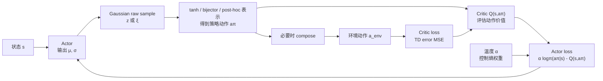
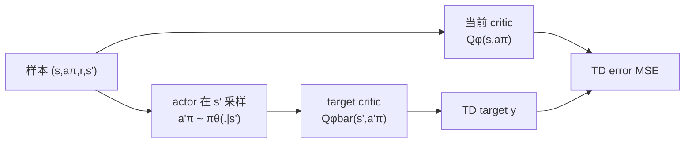
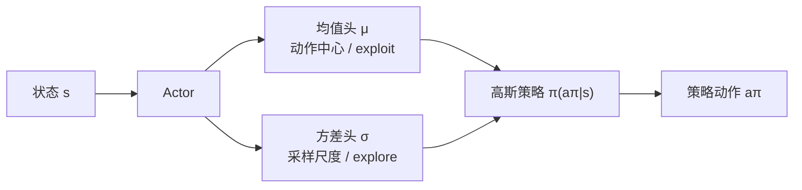
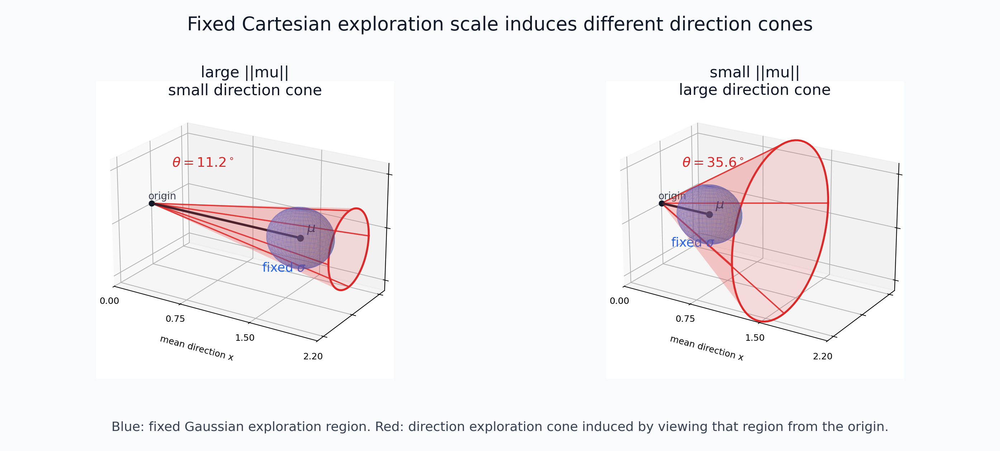
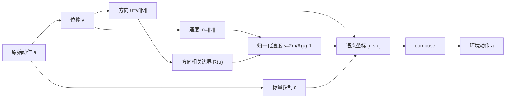
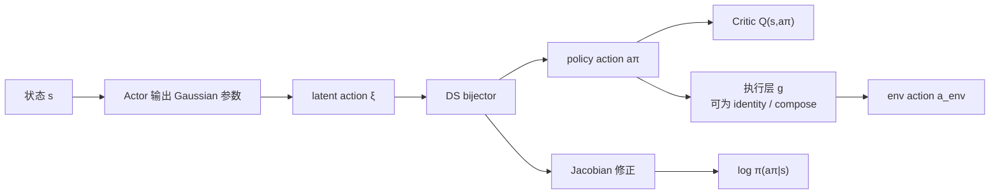

# 方向+速度动作分解

## 1. 背景：从 SAC 到探索的语义

方向-速度分层的动机来自 SAC 随机策略本身的一个表示问题：actor 用高斯分布探索，但高斯分布的坐标轴未必等于控制任务中真正有语义的坐标轴。本节先从连续控制常见 action space 讲起，再回顾 SAC 的 critic、actor 和 loss，最后引出为什么 Cartesian 三维高斯采样会把方向探索和速度探索耦合在一起。

### 1.1 动作空间：Delta World 与 Delta EE

机器人连续控制里的前三维动作通常表示末端执行器的位置增量，但这个增量至少有两种坐标语义：

$$
\Delta p = (\Delta x,\Delta y,\Delta z).
$$

一种是 **Delta World**，也就是在世界坐标系或机器人基座坐标系下表达的末端相对位移：

$$
p_{\text{target}}^{world}
=
p_{\text{ee}}^{world}
+
\Delta p^{world}.
$$

另一种是 **Delta EE**，也就是在末端执行器自身局部坐标系下表达的相对位移：

$$
p_{\text{target}}^{world}
=
p_{\text{ee}}^{world}
+
R_{\text{ee}}^{world}\Delta p^{ee}.
$$

二者都是“移动末端”，但方向语义不同：Delta World 的方向是全局方向，Delta EE 的方向会随末端姿态旋转。本文后续讨论的方向-速度分解只要求前三维是某个坐标系下的位移向量；如果任务使用 Delta World，则“方向”就是 world-frame 方向；如果任务使用 Delta EE，则“方向”就是 end-effector local-frame 方向。

在 OGBench manipulation / cube 这类环境中，前三维控制的是末端执行器位置增量，但这个增量是直接加到当前末端世界位置上的。因此更准确地说，它是 **end-effector position delta expressed in world frame**：控制对象是 EE position，坐标表达是 world/global frame。后文说的方向探索视锥，也是在这个 world-frame 位移向量上定义的。

### 1.2 三种 action：latent sample、policy action、env action

为了避免后文把不同层级的 action 混在一起，本文把 action 分成三类：

| 符号 | 含义 | 是否直接给环境执行 | 在哪里出现 |
| --- | --- | --- | --- |
| $z$ 或 $\xi$ | actor 从 Gaussian base distribution 采样出的内部随机变量，也称为 latent action | 否 | actor 内部采样、bijector inverse、log-prob 计算 |
| $a_\pi$ | 经过 tanh、bijector 或 post-hoc 表示后，actor 对外给训练算法使用的策略动作；它位于 SAC 的策略分布空间 | 视执行层是否还接转换而定 | $\pi(a_\pi \mid s)$、$Q(s,a_\pi)$、actor loss |
| $a_{\text{env}}$ | 环境原生动作，也就是 dataset / replay buffer / `env.step` 中的 env action，必须符合环境 action space 的维度和范围 | 是 | `env.step(a_env)`、真实 transition、dataset action |

三者在不同实现中是否相同并不一样：

| 实现 | latent sample | actor output / policy action $a_\pi$ | 环境原生动作 $a_{\text{env}}$ | SAC 公式中的动作变量 |
| --- | --- | --- | --- | --- |
| Baseline TanhNormal | $z\in\mathbb{R}^D$ | $a_\pi=\tanh(z)\in[-1,1]^D$ | $a_{\text{env}}=a_\pi$ | 可写 $a_\pi$，也可写 $a_{\text{env}}$，因为二者相等 |
| Post-hoc DS | $z\in\mathbb{R}^{D+1}$ | $a_\pi=\hat a=[\tilde u,s,c]\in\mathbb{R}^{D+1}$ | $a_{\text{env}}=\operatorname{compose}(\hat a)\in[-1,1]^D$ | 使用 $a_\pi$，也就是 $D+1$ 维 decomposed action；不使用 $a_{\text{env}}$ |
| Pure Bijector DS | $\xi$ | $a_\pi=f(\xi)$ | $a_{\text{env}}=a_\pi$ | 可写 $a_\pi$，也可写 $a_{\text{env}}$，因为二者相等 |
| Bijector + Post-hoc / Adapter | $\xi$ | $a_\pi=f(\xi)$ | $a_{\text{env}}=g(a_\pi)$，例如再 compose | 使用 $a_\pi$；若 $g$ 不可逆，不能把 `log_prob` 解释成 env-action density |

因此，SAC 公式里的 $a$ 不是永远指“actor 高斯里刚采样出来的 raw 值”。更准确地说：

$$
\mathcal{L}_{\text{actor}}
=
\mathbb{E}_{s\sim\mathcal{D},\,a_\pi\sim\pi_\theta}
\left[
\alpha\log\pi_\theta(a_\pi \mid s)
-
Q_\phi(s,a_\pi)
\right].
$$

其中 $a_\pi$ 是 actor 分布对训练算法暴露出来的动作变量。它是否等于环境原生动作 $a_{\text{env}}$，取决于 actor 输出后是否还接了额外的执行层转换。可以统一写成

$$
a_{\text{env}}=g(a_\pi).
$$

baseline 和 pure bijector 中 $g$ 是恒等映射，所以 $a_\pi=a_{\text{env}}$，此时 $Q$ 和 $\log\pi$ 里的动作变量可以写成 $a_\pi$，也可以写成 $a_{\text{env}}$。post-hoc 或 bijector+post-hoc 中 $g$ 可以是 compose，因此 $a_\pi$ 和 $a_{\text{env}}$ 不必相等；这时 SAC 内部必须写 $Q(s,a_\pi)$ 和 $\log\pi(a_\pi\mid s)$。

### 1.3 Critic 的输出与 loss

Critic 学习状态-动作价值函数 $Q_\phi(s,a_\pi)$，评估训练算法所使用的策略动作 $a_\pi$ 的未来累计回报。为了降低 Q 高估，常使用多个 Q 函数形成集成：

$$
Q_\phi(s,a_\pi)
= [Q_{\phi_1}(s,a_\pi), \ldots, Q_{\phi_N}(s,a_\pi)].
$$

critic 的训练目标是最小化时序差分误差（TD error）。一步 TD target 由 Bellman backup 给出：

$$
y
=
r+\gamma\,
\operatorname{Agg}
\left(
Q_{\bar{\phi}}(s',a'_\pi)
\right),
\qquad
a'_\pi\sim\pi_\theta(\cdot \mid s').
$$

其中 $\bar{\phi}$ 是 target critic 参数，$\operatorname{Agg}$ 可以是保守的最小值或平均值。critic loss 为

$$
\mathcal{L}_{\text{critic}}
=
\mathbb{E}_{(s,a_\pi,r,s')\sim\mathcal{D}}
\left[
\left(Q_\phi(s,a_\pi)-y\right)^2
\right].
$$

### 1.4 Actor 的输出与 loss

Actor 学习随机策略 $\pi_\theta(a_\pi \mid s)$。标准 SAC 中，actor 输出一个 $D$ 维对角高斯分布的均值和标准差：

$$
\mu_\theta(s),\quad \sigma_\theta(s)\in\mathbb{R}^D.
$$

也就是说，actor 实际上有两个头：

$$
\text{actor}(s)
\rightarrow
(\mu_\theta(s),\sigma_\theta(s)).
$$

$\mu$ 表示高斯分布的中心，$\sigma$ 表示高斯分布的尺度。对于前三维位移动作，可以把它们写成

$$
\mu_v=(\mu_x,\mu_y,\mu_z),
\qquad
\sigma_v=(\sigma_x,\sigma_y,\sigma_z).
$$

再从该分布中采样 latent action，并通过 squash 得到有界策略动作：

$$
z
\sim
\mathcal{N}
\left(
\mu_\theta(s),
\operatorname{diag}(\sigma_\theta(s)^2)
\right),
\qquad
a_\pi=\tanh(z).
$$

Actor loss 是软策略改进目标：

$$
\mathcal{L}_{\text{actor}}
=
\mathbb{E}_{s\sim\mathcal{D},\,a_\pi\sim\pi_\theta}
\left[
\alpha\log\pi_\theta(a_\pi \mid s)
-
Q_\phi(s,a_\pi)
\right].
$$

其中 $-Q_\phi(s,a_\pi)$ 鼓励选择高价值动作，$\alpha\log\pi_\theta(a_\pi \mid s)$ 对应最大熵正则。温度 $\alpha$ 控制探索强度：$\alpha$ 越大，策略越重视熵；$\alpha$ 越小，策略越接近纯粹利用 Q 值。

如果存在先验数据，还可以加入行为克隆项：

$$
\mathcal{L}_{\text{BC}}
=
-\beta
\mathbb{E}_{(s,a_{\text{data}})\sim\mathcal{D}}
\log\pi_\theta(a_{\text{data}} \mid s).
$$

这项鼓励策略不要远离数据分布，但不改变本文的核心问题：actor 的随机性仍然通过 $\mu,\sigma$ 表达。

### 1.5 Explore 与 exploit

强化学习的基本张力是 **explore** 和 **exploit**：

- **Exploit（利用）**：选择当前已知价值高的动作，把已经学到的知识兑现为回报。
- **Explore（探索）**：尝试尚不确定的动作，给策略发现更优行为的机会。

在 SAC 的高斯 actor 中：

- $\mu$ 更接近 exploit：它描述动作分布中心。
- $\sigma$ 更接近 explore：它描述围绕中心的采样半径。
- $\alpha$ 调节二者平衡。

这个解释隐含了一个前提：$\sigma$ 应该是可解释的探索量。也就是说，当我们增大 $\sigma$，最好能明确知道它增加的是哪一种探索。但在连续控制中，一个动作向量往往同时包含多个语义，此时逐维高斯探索的含义会变得混乱。

## 2. 问题：Cartesian 高斯探索耦合了方向和速度

连续控制任务的动作向量常常包含空间位移和若干标量控制项。例如可以写成

$$
a =
\underbrace{[a_x,a_y,a_z]}_{\text{空间位移 }v}
\;\Vert\;
\underbrace{c}_{\text{其他标量控制}}.
$$

前三维空间位移

$$
v=(a_x,a_y,a_z)
$$

同时承载两个语义：

$$
u=\frac{v}{\|v\|},
\qquad
m=\|v\|.
$$

其中 $u$ 是方向，$m$ 是速度或步长。但标准 actor 不是在 $(u,m)$ 上采样，而是在 Cartesian 坐标 $(x,y,z)$ 上逐维采样：

$$
z_i
\sim
\mathcal{N}(\mu_i,\sigma_i^2),
\qquad
i\in\{x,y,z\}.
$$

这意味着同一次高斯噪声会同时改变方向 $u$ 和速度 $m$。

### 2.1 固定 $\sigma$ 时，$\mu$ 的长度决定方向探索视锥

为了看清核心现象，先忽略 tanh 非线性，并假设三维标准差相同：

$$
\sigma_x=\sigma_y=\sigma_z=\sigma.
$$

此时可以把 actor 的前三维高斯理解成：以 $\mu_v$ 为中心，在 Cartesian 空间里放置一个由 $\sigma_v$ 决定大小的**固定置信水平下的等概率区域**。更准确地说，给定置信水平 $p$，例如 $p=95\%$，三维高斯的置信椭球可以写成

$$
(a-\mu_v)^\top
\Sigma_v^{-1}
(a-\mu_v)
\le
\chi^2_{3}(p),
$$

其中 $\Sigma_v=\operatorname{diag}(\sigma_x^2,\sigma_y^2,\sigma_z^2)$，$\chi^2_3(p)$ 是 3 维卡方分布的 $p$ 分位数。若 $\sigma_x=\sigma_y=\sigma_z$，这个 95% 置信区域近似是一个球；若各维 $\sigma_i$ 不同，则是一个椭球。图里画的蓝色球/椭球不是”所有可能动作”的边界，而是为了表达固定置信水平下的高概率采样区域。**该椭球是联合置信区域**（joint confidence region），保证总概率质量 = p——注意它和”每维 95% 区间拼成的长方体”不是一回事（后者只含 0.95³ ≈ 85.7% 联合质量）。

手稿里的关键洞察是：**蓝色区域表示 $\sigma$ 在某个固定置信水平下定义的动作采样置信椭球，红色视锥表示这个置信椭球投影到”方向”语义后得到的方向探索范围。**这两个东西不是同一个。置信水平和 $\sigma$ 固定时，蓝色置信椭球的体积不变，但红色视锥角会随 $\|\mu_v\|$ 改变。

定义

$$
l=\|\mu_v\|
=
\sqrt{\mu_x^2+\mu_y^2+\mu_z^2}.
$$

当 $\sigma<l$ 时，从原点到这个探索球的切线半角为：

$$
\theta
\approx
\arcsin
\frac{\sigma}{l}
\quad
(\text{小角度下也可近似为 } \arctan(\sigma/l)).
$$

因此，同一个 $\sigma$ 在不同 $l$ 下并不代表同一种方向探索。

| $l=\|\mu_v\|$ | 蓝色 95% 置信椭球 | 红色方向视锥 | 直观结果 |
| --- | --- | --- | --- |
| 大 | 大小不变 | 视锥角小 | 主要沿原方向伸缩，方向较稳定 |
| 中 | 大小不变 | 视锥角中等 | 方向和速度都会明显变化 |
| 小 | 大小不变 | 视锥角大 | 轻微噪声也可能把方向打散 |

也就是说：

- **$l$ 越小，方向探索的锥形角度越大**。当 actor 想输出小动作时，同样的 $\sigma$ 会让动作方向几乎随机化。
- **$l$ 越大，方向探索的锥形角度越小**。当 actor 输出较大位移时，同样的 $\sigma$ 更多表现为速度伸缩，方向变化反而较小。

这会造成一个具体问题：当 $\mu$ 比较小时，actor 本来可能只是想做小幅修正，但固定的 $\sigma$ 会带来过大的方向探索视锥，使动作方向在相邻采样间剧烈抖动。于是“探索”不再是可控地试探附近动作，而变成了小动作区域里的方向噪声放大。

上图用 Matplotlib 3D 静态图表达同一个现象：蓝色球表示固定 $\sigma$、固定置信水平下形成的局部高斯采样置信区域；更一般地，各维 $\sigma_i$ 不同时它会是置信椭球。可以把它理解成“例如 95% 概率质量所在的动作区域”的示意。红色锥体表示从原点看过去得到的方向探索视锥。左侧 $l=\|\mu_v\|$ 大，蓝色置信椭球离原点远，红色视锥较小；右侧 $l$ 小，蓝色置信椭球靠近原点，同样体积的置信椭球会覆盖更大的方向角度。

### 2.2 语义维度和表示维度不一致

问题的根源可以概括为：

$$
\text{表示维度}=(x,y,z),
\qquad
\text{语义维度}=(\text{方向},\text{速度}).
$$

SAC 的高斯分布在表示维度上定义噪声，但控制任务关心的是语义维度上的变化。只要这两套坐标不对齐，$\sigma$ 就不再是单纯、稳定、可解释的探索量。

## 3. 方法：动作空间的语义重参数化

核心假设是：位移的方向和幅值承担不同控制语义，应该在策略分布与探索噪声中被显式分离。

设连续动作 $a\in[-1,1]^D$ 可划分为空间位移 $v=a_{1:d}$ 和标量控制项 $c=a_{d+1:D}$。由于环境实际接收的是归一化动作，速度维度也应该定义在归一化动作空间中，而不是额外引入物理长度单位。

定义方向：

$$
m = \|v\|_2,\qquad
u = \frac{v}{\max(m,\epsilon)} \in S^{d-1}.
$$

对于 OGBench 这类前三维为 normalized cube 的动作空间，$v\in[-1,1]^3$，沿方向 $u$ 的最大合法半径不是固定的 1，而是 cube radial bound：

$$
R(u)=\frac{1}{\max_i |u_i|}.
$$

因此速度使用归一化比例：

$$
\rho=\frac{m}{R(u)}\in[0,1],
\qquad
s=2\rho-1\in[-1,1].
$$

并将动作表示为

$$
z = [u,\;s,\;c].
$$

其中 $u$ 位于单位球面，$s$ 是归一化速度坐标，$c$ 保留原始标量控制。反变换为

$$
\rho=\frac{s+1}{2},
\qquad
v = \rho R(\operatorname{norm}(u))\operatorname{norm}(u),
\qquad
a = [v,\;c].
$$

注意，逐维 Box 动作的空间位移范数上界是 $\sqrt{d}$ 而不是 1。如果简单使用固定半径 $m\le 1$，会把原本的 cube 动作空间裁成单位球。cube radial bound 的作用就是把“速度”定义成沿当前方向到 cube 边界的比例，因此 $s$ 可以自然保持在 $[-1,1]$，和 tanh 后的归一化动作语义一致。

### 3.1 结构化随机策略

DS 不在环境执行端额外注入噪声；探索仍来自 actor 自身的随机策略。区别在于随机变量的坐标系不同。

Baseline 在原始动作维度上使用独立 Gaussian，再通过 squash 得到动作；DS 则让 Gaussian latent 经过方向-速度参数化后生成环境动作：

$$
\xi\sim\mathcal{N}(\mu_\theta(o),\Sigma_\theta(o)),
\qquad
a=f_{\text{DS}}(\xi).
$$

这样，actor 的随机性仍然存在，但其作用方向与速度坐标一致，而不是在原始 Cartesian 维度上彼此纠缠。

对应到上一节的图像语言：baseline 的 $\sigma_v$ 先定义 Cartesian 空间里的蓝色采样置信椭球，再被动地诱导出一个随 $l=\|\mu_v\|$ 改变的红色方向视锥；DS 则直接在方向和速度上定义探索。方向维度的 $\sigma_u$ 固定时，方向探索视锥就固定；速度维度的 $\sigma_s$ 只影响沿当前方向的归一化速度比例，不会顺带改变方向。

### 3.2 速度维度：为什么使用归一化速度比例

方向-速度分解里，方向 $u$ 描述“往哪里走”，速度或步长描述“沿这个方向走多远”。但在归一化动作环境中，真正重要的不是物理距离的绝对值，而是当前方向上相对于动作边界的比例：

$$
\rho=\frac{\|v\|_2}{R(u)}.
$$

其中 $R(u)$ 是沿方向 $u$ 到达 normalized cube 边界的最大半径。这样 $\rho=0$ 表示不移动，$\rho=1$ 表示沿当前方向走到动作空间边界。actor 实际学习的速度坐标可以写成

$$
s=2\rho-1\in[-1,1],
\qquad
\rho=\frac{s+1}{2}.
$$

这种表示有两个好处。第一，它和环境动作的归一化约束对齐：不管方向指向坐标轴还是 cube 对角线，$s=1$ 都表示“到达该方向上允许的最大 normalized action”。第二，它和 tanh actor 的输出范围对齐：速度维度不需要额外的物理单位，也不需要无界变量，而是一个可解释的 bounded coordinate。

因此，速度噪声 $\sigma_s$ 的含义是“沿当前方向的 normalized speed ratio 的探索强度”。它不会改变方向，也不会因为不同方向上的 cube 半径不同而改变动作空间覆盖范围。

### 3.3 与时序扩展动作的结合

如果策略一次输出 $H$ 个连续动作，方向-速度重参数化可以逐时间步独立应用：

$$
z_{1:H}=[z_1,\ldots,z_H],
\qquad
z_t=[u_t,s_t,c_t].
$$

因此该方法不要求关闭时序扩展；它只要求每个时间步的动作语义都按“方向、速度、其他控制项”来解释。

## 4. 两类概率化参数化：Stereographic 与 Spherical

上述语义分解如果要用于 SAC 这类最大熵策略，还必须能计算动作概率密度。也就是说，actor 不只是要采样动作，还要知道

$$
\log\pi_\theta(a_\pi \mid s).
$$

如果策略动作经过变换 $a_\pi=f(\xi)$，则需要 change of variables：

$$
\log\pi(a_\pi)
=
\log p(\xi)
-
\log
\left|
\det
\frac{\partial f(\xi)}{\partial \xi}
\right|.
$$

因此，理想的 DS 策略分布需要一个可逆或几乎处处可逆的参数化。

### 4.1 Stereographic Cartesian 参数化

第一种方案避免直接输出 3D 冗余方向，而是在二维平面上采样点 $p=(p_x,p_y)$，再通过 inverse stereographic projection 得到单位方向：

$$
\rho^2=p_x^2+p_y^2,
\qquad
u(p)=
\left[
\frac{2p_x}{1+\rho^2},
\frac{2p_y}{1+\rho^2},
\frac{1-\rho^2}{1+\rho^2}
\right].
$$

速度由一个 unconstrained scalar 经过 bounded sigmoid 得到归一化速度比例：

$$
\rho=\sigma(r_{\text{raw}}),
\qquad
r=R(u(p))\rho,
\qquad
v=r\,u(p).
$$

该变换从 $(p_x,p_y,r_{\text{raw}})$ 到 3D 位移几乎处处可逆，并具有闭式 log-det：

$$
\log|J|
=
2\log r
+
\log\frac{4}{(1+\rho^2)^2}
+
\log
\left|
\frac{\partial r}{\partial r_{\text{raw}}}
\right|.
$$

它保留 Cartesian 位移动作的形式，同时把方向和速度的探索语义分开。

### 4.2 Spherical 参数化

第二种方案使用两个角度参数化单位球面。latent 坐标为

$$
\xi=[\theta_{\text{raw}},\phi_{\text{raw}},r_{\text{raw}}],
$$

并通过可逆变换得到

$$
\theta=\pi\sigma(\theta_{\text{raw}}),
\qquad
\phi=2\pi\sigma(\phi_{\text{raw}}),
\qquad
\rho=\sigma(r_{\text{raw}}),
\qquad
r=R(u)\rho,
$$

$$
v
=
r[
\sin\theta\cos\phi,
\sin\theta\sin\phi,
\cos\theta
].
$$

该方案几何意义直接，但球坐标在极点附近会出现退化，角度也有周期性。

### 4.3 Cube radial bound

如果环境前三维动作本身是 normalized cube：

$$
v=(x,y,z)\in[-1,1]^3,
$$

那么固定半径 $r\le 1$ 实际覆盖的是单位球 $\|v\|\le 1$，不是完整 cube。cube radial bound 把速度上界写成方向相关的边界：

$$
R(u)=\frac{1}{\max(|u_x|,|u_y|,|u_z|)},
\qquad
r=R(u)\sigma(r_{\text{raw}}),
\qquad
v=r u.
$$

它的含义是：沿方向 $u$ 从原点出发，最多走到 cube 边界的距离。这样 actor 仍然学习“方向 + 归一化速度比例”，但最终 $v$ 可以覆盖完整的 $[-1,1]^3$，再交给环境底层做 component-wise scale。

在 bijector 中，cube radial bound 仍然几乎处处可逆。log-det 中的径向体积缩放由 $R(u)^3$ 决定；$R(u)$ 在多个坐标绝对值相等的位置不可微，但这些位置是 measure-zero，通常不影响基于密度的训练。

### 4.4 对比

| 维度 | Stereographic Cartesian | Spherical Angles |
| --- | --- | --- |
| 方向坐标 | 2D 平面点投影到 $S^2$ | $(\theta,\phi)$ 两角度 |
| 单步动作维度 | $D$ | $D$ |
| 方向解释 | 平面扰动对应球面方向扰动 | 角度直接定义方向 |
| `log_prob` | 含 stereographic/radial Jacobian | 含 spherical/radial Jacobian |
| 主要风险 | stereographic chart 在一个极点退化 | 球坐标极点/角度周期退化 |

## 5. Post-hoc 与 Bijector：两种层级的区别

方向-速度分解可以发生在两个不同层级：模型外部的数据/执行层，或者 actor 内部的概率分布层。二者的核心区别是：变换是否属于策略分布本身。

### 5.1 Post-hoc：模型外部的语义表示

Post-hoc 方案保留一个冗余的三维方向向量，让 actor 输出

$$
\hat a=[\tilde u_x,\tilde u_y,\tilde u_z,s,c]\in\mathbb{R}^{D+1}.
$$

执行前使用确定性 compose。这里 $s$ 是 bounded speed coordinate：

$$
u=
\frac{\tilde u}{\max(\|\tilde u\|_2,\epsilon)},
\qquad
\rho=\frac{s+1}{2}\in[0,1],
\qquad
R(u)=\frac{1}{\max_i |u_i|},
\qquad
v=\rho R(u)u,
\qquad
a=[v,c]\in\mathbb{R}^D.
$$

这样 post-hoc 的 actor 输出维度仍是 $D+1$，但速度维度天然落在 tanh 友好的 $[-1,1]$，并且可以覆盖完整 normalized cube。

在当前 post-hoc 实现中，actor 和 critic 训练时使用的是同一个 $D+1$ 维动作变量 $\hat a$：

$$
\pi_\theta(\hat a \mid s),
\qquad
Q_\phi(s,\hat a).
$$

环境实际执行的不是 $\hat a$，而是

$$
a_{\text{env}}
=
\operatorname{compose}(\hat a).
$$

因此 post-hoc 内部的 actor/critic 是对齐的，但它们对齐在 $D+1$ 维 decomposed action 上，而不是严格的 env-action density 上。可以把 critic 的语义理解为

$$
Q_{\text{posthoc}}(s,\hat a)
\approx
Q_{\text{env}}(s,\operatorname{compose}(\hat a)).
$$

关键问题是归一化会丢弃 $\tilde u$ 的径向长度。对于任意正数 $\lambda$，

$$
\operatorname{norm}(\lambda\tilde u)
=
\operatorname{norm}(\tilde u).
$$

因此

$$
[\tilde u,s,c],
\quad
[2\tilde u,s,c],
\quad
[100\tilde u,s,c]
$$

都会映射到同一个 env action。这是多对一映射，而不是 bijection。

这带来三个理论影响：

1. **没有普通 change-of-variables log-prob。** 映射是 $D+1\rightarrow D$，Jacobian 不是方阵，也没有唯一 inverse。
2. **方向向量长度是不可观测自由度。** 模型可能把容量用在执行端会被丢弃的径向自由度上。
3. **训练坐标和执行动作存在近似错位。** 分解空间中的密度不等于 env action 空间中的严格密度。

因此，post-hoc 更适合作为表示消融或工程近似，而不适合作为需要严格概率密度的最大熵策略分布。

### 5.2 Bijector：actor 分布内部的语义变换

Bijector 方案把方向-速度结构写进 actor 的概率分布内部：

外部看，actor 对训练算法暴露的是 policy action $a_\pi$；内部看，Gaussian latent action 先经过方向-速度 bijector，再成为 $a_\pi$。因为该变换具有 forward、inverse 和 log-det Jacobian，所以可以得到 $a_\pi$ 上的严格概率密度：

$$
\log\pi(a_\pi)
=
\log p(\xi)
-
\log|\det J_f(\xi)|.
$$

这里的 bijector 只保证

$$
a_\pi
=
f(\xi).
$$

至于环境实际执行什么，取决于 actor 输出后是否还接外部转换：

$$
a_{\text{env}}
=
g(a_\pi).
$$

如果是 pure bijector，$g$ 是恒等映射，因此 $a_\pi=a_{\text{env}}$，这时可以把 $\log\pi_\theta(a_\pi\mid s)$ 和 $Q_\phi(s,a_\pi)$ 等价写成 $\log\pi_\theta(a_{\text{env}}\mid s)$ 和 $Q_\phi(s,a_{\text{env}})$。如果 bijector 后还接 post-hoc compose 或其他 adapter，则 $a_\pi$ 和 $a_{\text{env}}$ 不必相等；SAC 内部仍优化

$$
\log\pi_\theta(a_\pi \mid s),
\qquad
Q_\phi(s,a_\pi),
$$

而不是自动变成 $\log\pi_\theta(a_{\text{env}} \mid s)$。除非把 $g$ 也纳入一个整体可逆 bijector，否则经过不可逆 compose 后就不能声称有严格的 env-action density。

### 5.3 对比

| 维度 | Post-hoc | Bijector |
| --- | --- | --- |
| 变换位置 | 模型外部 | actor 分布内部 |
| 模型视角 | 分解动作空间 | bijector 输出的 policy action 空间 |
| 可逆性 | 多对一，不可逆 | bijector 层有 forward + inverse；若后接不可逆 adapter，整体链路不再严格可逆 |
| `log_prob` | 分解空间近似密度 | $a_\pi$ 上的严格密度；仅当 $a_\pi=a_{\text{env}}$ 时也可写成 env-action density |
| 理论定位 | 表示消融 / 近似方案 | 概率自洽的最大熵策略 |

## 6. 总结

标准 SAC actor 在 Cartesian 坐标中使用逐维高斯探索。对于三维位移动作，这会把方向和速度两个语义混在一起：同一个 $\sigma$ 在大 $\mu$ 和小 $\mu$ 下对应完全不同的方向探索视锥。尤其当 $\mu$ 较小时，固定 $\sigma$ 会造成方向探索角度过大，从而导致动作剧烈抖动。

方向-速度分层的核心价值是把探索重新放回语义坐标：

- 方向上的 $\sigma_u$ 控制方向探索视锥。
- 速度上的 $\sigma_s$ 控制速度或步长探索。
- 二者互不干扰，策略不确定性更可解释。
- stereographic / spherical bijector 给出概率自洽的分布层实现。
- post-hoc 表示保留了直觉上的方向-速度分解，但由于非可逆，更适合作为近似或消融。

因此，方向-速度分层不是额外探索噪声，而是对 actor 随机策略坐标系的重新选择：让分布参数对应控制任务中真正有意义的探索维度。
