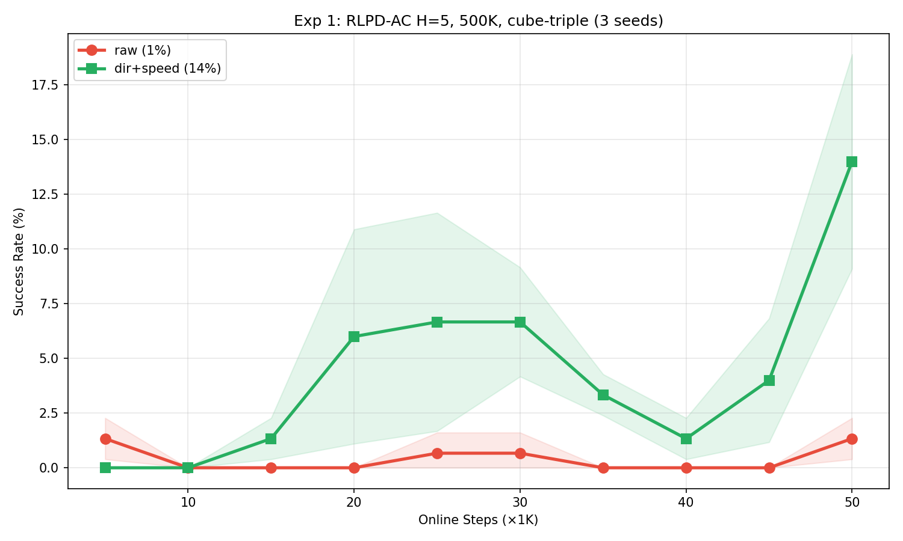
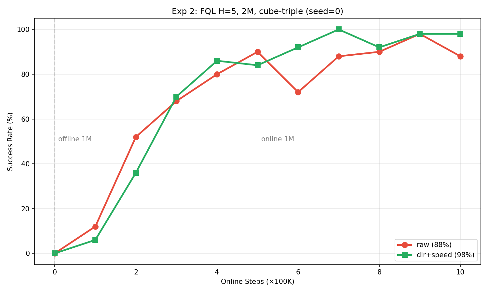

# QC (Q-Chunking) 复现实验报告

环境: `cube-triple-play-singletask-task2-v0` | seed: 0 | 观察维度: 46 | 动作维度: 5

## 正式复现结果 (1M 步)

| 方法 | 入口 | H | 关键参数 | 训练方式 | 最终 | 论文 | CI |
|------|------|---|---------|---------|------|------|-----|
| **QC** | main.py | 5 | best-of-n=32 | 离线1M→在线1M | **96%** | 89% | 81.5-93.5% |
| **RLPD** | main_online.py | 1 | — | 纯在线 | **74%** | 60% | 22.5-87% |
| **RLPD-AC** | main_online.py | 5 | 无BC约束 | 纯在线 | **2%** | 2% | 0-3% |

## 长序训练实验 (10M 步)

| 方法 | H | BC约束 | 最终 | 最佳 | 突破点 |
|------|---|--------|------|------|--------|
| **RLPD-AC** | 5 | 无 | **88%** | 98% @7.6M | ~1.5M |
| **QC-RLPD** | 5 | bc_alpha=0.01 | **90%** | 100% @9.3M | ~2.5M |

### 关键发现

1. **H=5 纯在线需要更多样本，但最终可达 90%**。
2. **bc_alpha=0.01 在长序训练中有效**。
3. **1M 步不足以判断 H=5 方法的优劣**。

## 关键技术细节

- **控制频率**: 20 Hz
- **动作空间**: H=5 时 25 维
- **GPU**: RTX 4090 ×1
- **并行**: `taskset` CPU 绑核, `XLA_PYTHON_CLIENT_PREALLOCATE=false`

---

## 方向+速度分解实验

### 方法

将动作 `a ∈ [-1,1]^D` 的前 3 维位移分解为方向+速度：

| 表示 | 编码 |
|------|------|
| raw | `a` |
| dir+speed | `[a[:3]/|a[:3]|, log|a[:3]|, a[3:]]` |

Agent 在分解空间学习，采样后重组送环境。详见 [approach.md](approach.md)。

### 实验结果汇总

| 实验 | Agent | H | 步数 | raw | dir+speed | 入口 |
|------|-------|:--:|:--:|:--:|:--:|------|
| 1 | RLPD-AC | 5 | 500K | 1.3% | **14.0%** | main_online |
| 2 | FQL | 5 | 2M | 88% | **98%** | main.py |
| 3 | RLPD | 1 | 1M | **60%** | — | main_online |
| 4 | RLPD-AC | 1 | 1M | — | 7.0% | main_online |

> 实验 1: 3 seeds, cube-triple+cube-double. 实验 2: 1 seed, cube-triple. 实验 3: 3 seeds. 实验 4: 2 seeds.

图 1 使用 `--ds_mode=posthoc` 的非可逆 D+1 direction-speed 表示，即执行前对 actor 输出做确定性 decompose/compose；它不是 Jacobian-corrected `spherical` 或 `stereographic` bijector。

图 2 同样使用 `--ds_mode=posthoc` 的非可逆 D+1 direction-speed 表示，用于 FQL 表示消融；FQL 不依赖 SAC/RLPD actor `log_prob`，因此该图不能替代 RLPD 的 bijector 正确性验证。

### 核心结论

1. **dir+speed 在所有对比中均优于 raw**
2. **困难任务收益最大**：RLPD-AC H=5 从 1.3% → 14%
3. **3D 归一化（正确）vs 5D 归一化（有偏但有效）**：5D 更快收敛但 3D 几何正确
4. **分解表示本身足够**：结构化噪声可有可无

### 实验数据

| 实验 | exp/qc 目录 |
|------|------|
| 实验 1 | `DirSpeed_RLPD_H5_500K` |
| 实验 2 | `DirSpeed_FQL_H5_2M` |
| 实验 3 | `ReproDS` |
| 实验 4 | `DS3D` |

### 实现

| 文件 | 说明 |
|------|------|
| `direction_speed.py` | 分解核心模块 |
| `main_online.py` | 纯在线 (`--direction_speed`) |
| `main.py` | 离线→在线 (`--direction_speed`) |
| `agents/acrlpd.py` | RLPD/RLPD-AC agent |
