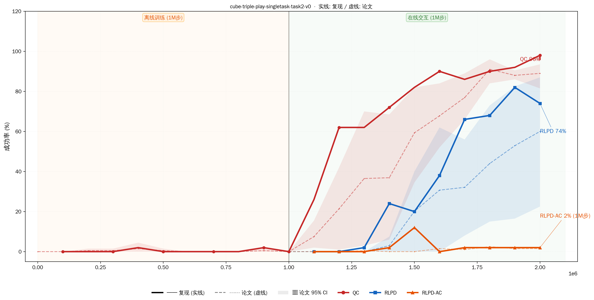
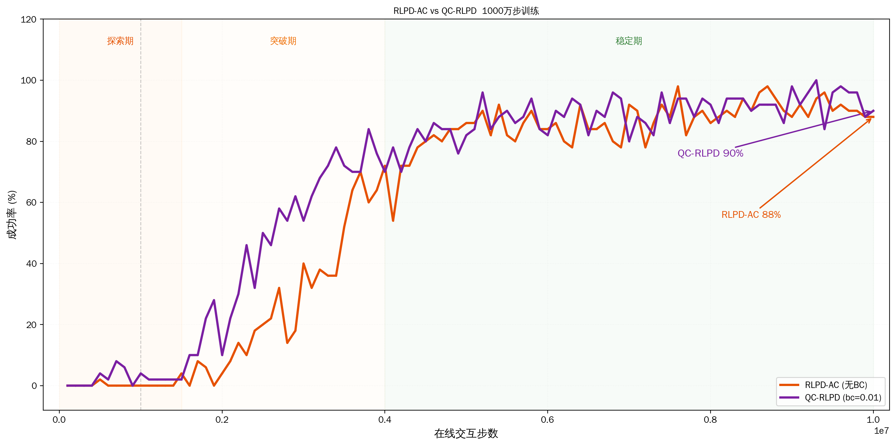
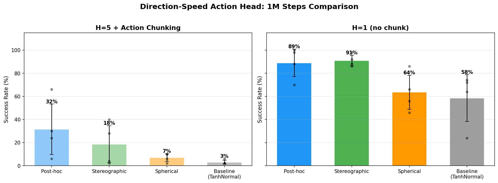
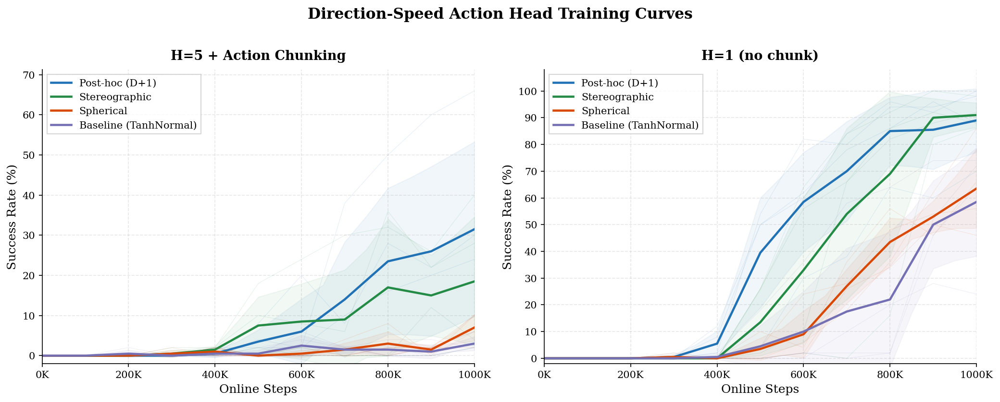

# QC (Q-Chunking) 复现实验报告

环境: `cube-triple-play-singletask-task2-v0` | seed: 0 | 观察维度: 46 | 动作维度: 5

## 正式复现结果 (1M 步)

| 方法 | 入口 | H | 关键参数 | 训练方式 | 最终 | 论文 | CI |
|------|------|---|---------|---------|------|------|-----|
| **QC** | main.py | 5 | best-of-n=32 | 离线1M→在线1M | **96%** | 89% | 81.5-93.5% |
| **RLPD** | main_online.py | 1 | — | 纯在线 | **74%** | 60% | 22.5-87% |
| **RLPD-AC** | main_online.py | 5 | 无BC约束 | 纯在线 | **2%** | 2% | 0-3% |

## 长序训练实验 (10M 步)

| 方法 | H | BC约束 | 最终 | 最佳 | 突破点 |
|------|---|--------|------|------|--------|
| **RLPD-AC** | 5 | 无 | **88%** | 98% @7.6M | ~1.5M |
| **QC-RLPD** | 5 | bc_alpha=0.01 | **90%** | 100% @9.3M | ~2.5M |

### 关键发现

1. **H=5 纯在线需要更多样本，但最终可达 90%**。
2. **bc_alpha=0.01 在长序训练中有效**。
3. **1M 步不足以判断 H=5 方法的优劣**。

## 关键技术细节

- **控制频率**: 20 Hz
- **动作空间**: H=5 时 25 维
- **GPU**: RTX 4090 ×1
- **并行**: `taskset` CPU 绑核, `XLA_PYTHON_CLIENT_PREALLOCATE=false`

---

## 三种 DS 实现 + Baseline 对比实验 (1M 步)

验证 [approach.md](approach.md) 中 posthoc（D+1 非可逆）、stereographic（球极投影 bijector）、spherical（球坐标 bijector）三种 DS 实现，在 H=1（无 chunk）和 H=5（有 chunk）下的表现。

### 实验配置

- 环境: `cube-triple-play-singletask-task2-v0`
- 步数: 1,000,000
- Agent: ACRLPD
- 双卡并行: GPU 0 + GPU 1，4 并发/卡，4 seed/组
- 脚本: `run_ds_h5_1m.sh`, `run_ds_h1_1m.sh`
- 日志: `logs/ds_h5_1m/`, `logs/ds_h1_1m/`

### 结果

| 组 | H=5+chunk | ±std | H=1(无chunk) | ±std |
|---|:---:|:---:|:---:|:---:|
| **Post-hoc** | 31.5% | 21.8% | 89.0% | 11.9% |
| **Stereographic** | 18.5% | 16.1% | **91.0%** | 4.6% |
| **Spherical** | 7.0% | 3.3% | 63.5% | 14.8% |
| **Baseline** (TanhNormal) | 3.0% | 1.7% | 58.5% | 20.3% |

### 每 seed 详细数据

#### H=5 + Action Chunking

| 组 | s0 | s1 | s2 | s3 | 均值 |
|---|:---:|:---:|:---:|:---:|:---:|
| posthoc | 24% | 66% | 6% | 30% | 31.5% |
| stereographic | 40% | 4% | 2% | 28% | 18.5% |
| spherical | 10% | 6% | 10% | 2% | 7.0% |
| baseline | 6% | 2% | 2% | 2% | 3.0% |

#### H=1 (无 chunk)

| 组 | s0 | s1 | s2 | s3 | 均值 |
|---|:---:|:---:|:---:|:---:|:---:|
| posthoc | 100% | 88% | 70% | 98% | 89.0% |
| stereographic | 86% | 92% | 98% | 88% | 91.0% |
| spherical | 56% | 46% | 66% | 86% | 63.5% |
| baseline | 74% | 64% | 24% | 72% | 58.5% |

### 结论

1. **H=1 全面碾压 H=5**：所有方法在无 chunk 配置下远优于 chunk 配置，同时 H=1 训练更快（~2.5h vs ~2.5h，但 H=5 需更大网络处理 25 维动作）
2. **Stereographic ≈ Post-hoc（H=1 下仅差 2%）**：两种方法在正确配置下极为接近，Stereographic 具有 Jacobian-corrected log_prob 优势
3. **Stereographic 方差最小**（H=1: ±4.6%）：表现最稳定，推荐作为主力 DS 实现
4. **Spherical 弱于 Stereographic**：球坐标参数化在极点和角度周期处 Jacobian 退化，不如球极投影稳定
5. **Post-hoc D+1 在 H=5 下异常突出**（31.5% vs 18.5%）：可能高方差随机波动，也可能 D+1 表示在欠参数化时提供额外探索自由度，但 log_prob 不是严格 Jacobian-corrected，不能作为 SAC/RLPD 正式方法
6. **所有 DS 变体均优于 Baseline TanhNormal**：方向-速度分解本身收益明确

### 数据

原始实验数据位于 `docs/data/ds_experiments/`，包含 eval.csv、flags.json、online_agent.csv、params_500000.pkl、params_1000000.pkl。

汇总 CSV：`docs/data/ds_1m_comparison.csv`、`docs/data/ds_h5_1m.csv`、`docs/data/ds_h1_1m.csv`。
