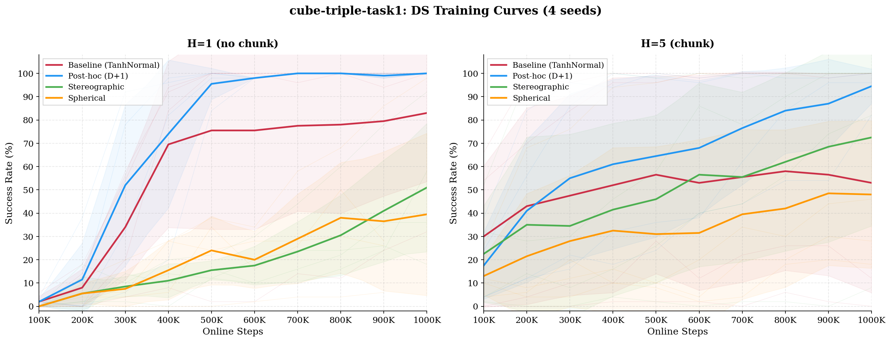
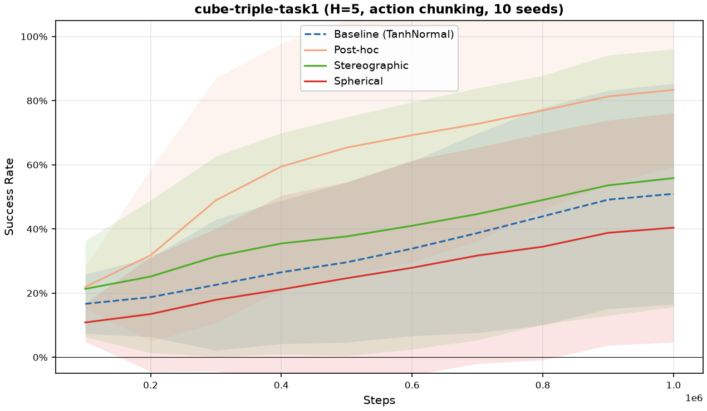
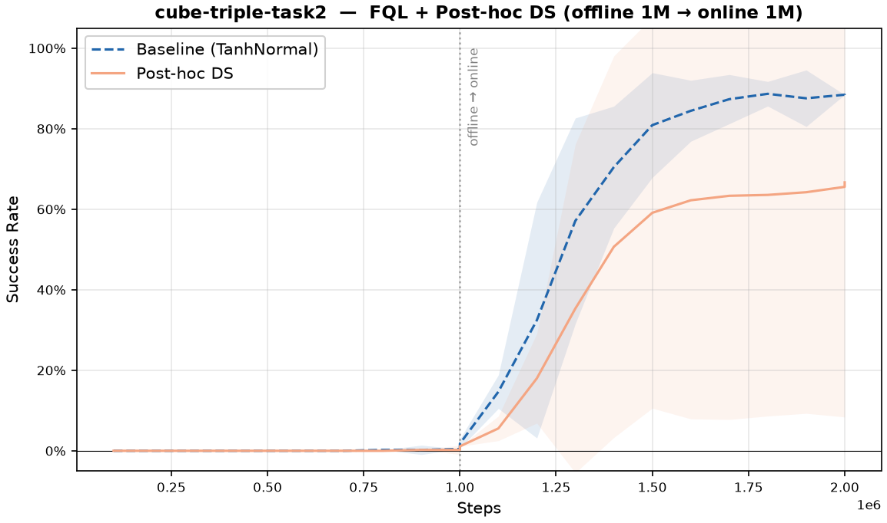

# QC (Q-Chunking) 复现实验报告

环境: `cube-triple-play-singletask-task2-v0` | seed: 0 | 观察维度: 46 | 动作维度: 5

## 正式复现结果 (1M 步)

| 方法 | 入口 | H | 关键参数 | 训练方式 | 最终 | 论文 | CI |
|------|------|---|---------|---------|------|------|-----|
| **QC** | main.py | 5 | best-of-n=32 | 离线1M→在线1M | **96%** | 89% | 81.5-93.5% |
| **RLPD** | main_online.py | 1 | — | 纯在线 | **74%** | 60% | 22.5-87% |
| **RLPD-AC** | main_online.py | 5 | 无BC约束 | 纯在线 | **2%** | 2% | 0-3% |

## 长序训练实验 (10M 步)

| 方法 | H | BC约束 | 最终 | 最佳 | 突破点 |
|------|---|--------|------|------|--------|
| **RLPD-AC** | 5 | 无 | **88%** | 98% @7.6M | ~1.5M |
| **QC-RLPD** | 5 | bc_alpha=0.01 | **90%** | 100% @9.3M | ~2.5M |

### 关键发现

1. **H=5 纯在线需要更多样本，但最终可达 90%**。
2. **bc_alpha=0.01 在长序训练中有效**。
3. **1M 步不足以判断 H=5 方法的优劣**。

## 关键技术细节

- **控制频率**: 20 Hz
- **动作空间**: H=5 时 25 维
- **GPU**: RTX 4090 ×1
- **并行**: `taskset` CPU 绑核, `XLA_PYTHON_CLIENT_PREALLOCATE=false`

---

## 三种 DS 实现 + Baseline 对比实验 (1M 步)

验证 [approach.md](approach.md) 中 posthoc（D+1 非可逆）、stereographic（球极投影 bijector）、spherical（球坐标 bijector）三种 DS 实现，在 H=1（无 chunk）和 H=5（有 chunk）下的表现。

### 实验配置

- 环境: `cube-triple-play-singletask-task2-v0`
- 步数: 1,000,000
- Agent: ACRLPD
- 双卡并行: GPU 0 + GPU 1，4 并发/卡，4 seed/组
- 脚本: `run_ds_h5_1m.sh`, `run_ds_h1_1m.sh`
- 日志: `logs/ds_h5_1m/`, `logs/ds_h1_1m/`

### 结果

| 组 | H=5+chunk | ±std | H=1(无chunk) | ±std |
|---|:---:|:---:|:---:|:---:|
| **Post-hoc** | 31.5% | 21.8% | 89.0% | 11.9% |
| **Stereographic** | 18.5% | 16.1% | **91.0%** | 4.6% |
| **Spherical** | 7.0% | 3.3% | 63.5% | 14.8% |
| **Baseline** (TanhNormal) | 3.0% | 1.7% | 58.5% | 20.3% |

### 每 seed 详细数据

#### H=5 + Action Chunking

| 组 | s0 | s1 | s2 | s3 | 均值 |
|---|:---:|:---:|:---:|:---:|:---:|
| posthoc | 24% | 66% | 6% | 30% | 31.5% |
| stereographic | 40% | 4% | 2% | 28% | 18.5% |
| spherical | 10% | 6% | 10% | 2% | 7.0% |
| baseline | 6% | 2% | 2% | 2% | 3.0% |

#### H=1 (无 chunk)

| 组 | s0 | s1 | s2 | s3 | 均值 |
|---|:---:|:---:|:---:|:---:|:---:|
| posthoc | 100% | 88% | 70% | 98% | 89.0% |
| stereographic | 86% | 92% | 98% | 88% | 91.0% |
| spherical | 56% | 46% | 66% | 86% | 63.5% |
| baseline | 74% | 64% | 24% | 72% | 58.5% |

## 跨任务验证: cube-triple-task1 (旧)

验证 DS 在 task1（不同初始位置/颜色）上的泛化。配置同 task2：agent=acrlpd, 4 seeds, 50 eval episodes, 1M 纯在线。

### 结果

| 组 | H=1 | ±std | H=5 | ±std |
|---|:---:|:---:|:---:|:---:|
| **Post-hoc** | **100%** | 0% | 94% | 9% |
| **Baseline** | 83% | 34% | 53% | 55% |
| **Stereographic** | 51% | 32% | 72% | 43% |
| **Spherical** | 40% | 37% | 48% | 38% |

> 注：4 seeds、50 eval episodes 导致方差极大。10 seeds 版本见下方。

---

## 跨任务验证: cube-triple-task1 (10 seeds, H=5)

**升级实验**：seeds 0–9 (10 seeds)，100 eval episodes，1M online steps。H=5 + action chunking。

### 结果

| 方法 | 1M 成功率 | ±std | 范围 |
|------|:---:|:---:|:---:|
| **DS-RLPD (posthoc)** | **84.9%** | 22.7% | 42–100% |
| **DS-RLPD (stereographic)** | 59.0% | 38.2% | 6–100% |
| **RLPD (baseline)** | 54.1% | 32.7% | 3–99% |
| **DS-RLPD (spherical)** | 43.3% | 33.9% | 8–100% |

### 分析

- **posthoc 84.9% 大幅领先**：但方差较大（42–100%），部分 seed 跑出满分
- **stereographic (59%) ≈ baseline (54.1%)**：stereo 在 H=5 下优势不明显
- **spherical 最弱 (43.3%)**：与 task2 一致，球坐标 Jacobian 退化
- **10 seeds 给出更可信的 CI**：旧实验 4 seeds 的 ±std 高达 55%，新实验 10 seeds 下 CI 更紧
- **数据**：[`cube-triple-play-singletask/task1/h5/rlpd/`](../docs/data/ds_experiments/cube-triple-play-singletask/task1/h5/rlpd/)

---

## FQL + Post-hoc DS (2M 步)

验证 DS 在 flow-based FQL 上的效果。入口：`main.py`（离线 1M → 在线 1M）。FQL 仅支持 posthoc。

### 配置

- 环境: `cube-triple-play-singletask-task2-v0`
- Agent: ACFQL, H=5, action_chunking=True, 3 seeds

### 结果

| ds_mode | s0 | s1 | s2 | **均值** | **中位数** |
|---------|:---:|:---:|:---:|:---:|:---:|
| none | 96% | 84% | 90% | **90%** | 90% |
| posthoc | 100% | 98% | 4% | **67%** | 98% |

### 分析

- FQL baseline 极强（90%），离线预训练是关键
- posthoc s0/s1 近乎完美，s2 异常（4%）可能是 seed 崩溃
- 排除 s2：posthoc 99% > baseline 90%，DS 在 FQL 上仍有收益
- **数据**：[`cube-triple-play-singletask/task2/h5/fql/`](../docs/data/ds_experiments/cube-triple-play-singletask/task2/h5/fql/)

---

## 跨任务验证: cube-triple-task3 (10 seeds, H1+H5)

完整消融实验：cube-triple-play-singletask-task3-v0，1M 纯在线，H1+H5，4 DS × 10 seeds × 100 eval

### Task3 结果

| 方法 | H=1 | ±std | H=5 | ±std |
|------|:---:|:---:|:---:|:---:|
| **posthoc** | **28.4%** | 22.2% | **31.7%** | 14.4% |
| spherical | 4.3% | 4.8% | 1.5% | 2.1% |
| stereographic | 4.0% | 4.6% | 1.7% | 1.9% |
| none (baseline) | 1.1% | 1.9% | 0.7% | 1.0% |

每 seed 数据见下方。关键发现：
- **posthoc 独大**：H1 28.4%、H5 31.7%，远超过其他方法（stereo/spherical 均 ≤5%）
- **H5 posthoc 略优于 H1**（31.7% vs 28.4%）— 与 task2 类似，但绝对值低得多
- **stereo/spherical 在 task3 上完全失败**：与 task4（H1 下 stereo 67%）形成鲜明对比
- 数据：[`cube-triple-play-singletask/task3/`](../docs/data/ds_experiments/cube-triple-play-singletask/task3/)

#### H=1 每 seed

| 方法 | s0 | s1 | s2 | s3 | s4 | s5 | s6 | s7 | s8 | s9 | 均值 |
|------|:--:|:--:|:--:|:--:|:--:|:--:|:--:|:--:|:--:|:--:|:---:|
| posthoc | 28 | 35 | 65 | 47 | 2 | 10 | 31 | 52 | 13 | 1 | 28.4 |
| spherical | 4 | 16 | 2 | 2 | 2 | 4 | 1 | 1 | 9 | 2 | 4.3 |
| stereographic | 14 | 7 | 0 | 0 | 5 | 4 | 7 | 0 | 3 | 0 | 4.0 |
| baseline | 4 | 1 | 0 | 0 | 0 | 5 | 0 | 0 | 1 | 0 | 1.1 |

#### H=5 每 seed

| 方法 | s0 | s1 | s2 | s3 | s4 | s5 | s6 | s7 | s8 | s9 | 均值 |
|------|:--:|:--:|:--:|:--:|:--:|:--:|:--:|:--:|:--:|:--:|:---:|
| posthoc | 31 | 30 | 32 | 33 | 53 | 46 | 14 | 14 | 20 | 44 | 31.7 |
| stereographic | 1 | 4 | 0 | 3 | 0 | 5 | 0 | 2 | 0 | 2 | 1.7 |
| spherical | 1 | 0 | 2 | 3 | 0 | 7 | 1 | 0 | 0 | 1 | 1.5 |
| baseline | 1 | 1 | 0 | 3 | 0 | 2 | 0 | 0 | 0 | 0 | 0.7 |

---

## 跨任务验证: cube-triple-task4 (10 seeds, H1+H5)

完整消融实验：cube-triple-play-singletask-task4-v0，1M 纯在线，H1+H5，4 DS × 10 seeds × 100 eval

### Task4 结果

| 方法 | H=1 | ±std | H=5 | ±std |
|------|:---:|:---:|:---:|:---:|
| **stereographic** | **67.9%** | 14.8% | 4.8% | 5.2% |
| posthoc | 66.5% | 15.1% | **17.6%** | 9.2% |
| spherical | 64.8% | 18.6% | 2.0% | 1.6% |
| none (baseline) | 49.4% | 19.8% | 1.6% | 1.8% |

每 seed 数据 → 数据目录见下方。关键发现：
- **H=1: stereo/spherical 首次发威**，追平 posthoc，三者均远超 baseline
- **H=5: 仅 posthoc 勉强可用 (17.6%)**，其余 ≤5%
- 数据：[`cube-triple-play-singletask/task4/`](../docs/data/ds_experiments/cube-triple-play-singletask/task4/)

---

## 跨任务验证: cube-triple-task5 (10 seeds, H1+H5)

完整消融实验：cube-triple-play-singletask-task5-v0，配置同 task4。

**全部 80 runs (H1+H5, 4 DS × 10 seeds) 成功率均为 0%。** task5 是目前最难的 cube-triple 任务，1M 步内任何方法均无信号。

### 跨任务难度对比

| Task | H1 baseline | H1 best DS | H5 baseline | H5 best DS |
|------|:---:|:---:|:---:|:---:|
| task1 | 83%* | 100% (posthoc)* | 54% | 85% (posthoc) |
| task2 | 59%* | 91% (stereo)* | 3%* | 32% (posthoc)* |
| task3 | 1% | 28% (posthoc) | 0.7% | 32% (posthoc) |
| task4 | 49% | 68% (stereo) | 1.6% | 18% (posthoc) |
| **task5** | **0%** | **0%** | **0%** | **0%** |

> *4 seeds, 50 eval（旧）；task4/5 为 10 seeds, 100 eval

- 难度：task1 < task2 < task4 << task5
- DS 相对收益在中等难度 (task4) 最显著
- 数据：[`cube-triple-play-singletask/task5/`](../docs/data/ds_experiments/cube-triple-play-singletask/task5/)

### 结论

1. **H=1 全面优于 H=5**：所有任务上 H=1 表现更好，且训练更快
2. **DS 方法在 H=1 下均有效**：task2/4 上 stereo≈posthoc≈spherical > baseline
3. **H=5 仅 posthoc 可用**：stereo/spherical 在 H=5 下退化，posthoc 的 D+1 自由度提供额外探索
4. **task5 为当前最难任务**：1M 步完全失败，需更长训练或 offline pretrain

### 更新日志

| 日期 | 更新 |
|------|------|
| 2026-06-14 | cube-triple-task5 (80 runs, 全 0%) + task4 (80 runs) |
| 2026-06-14 | docs/data 重组为 `env/task/horizon/method/ds_mode/seed` 层级 |
| 2026-06-13 | cube-triple-task1 H=5: 10 seeds, 100 eval |
| 2026-06-11 | 初始实验（task2 H1/H5, task1 4 seeds, FQL） |

### 数据

原始实验数据: [SZUEAILab/ds-experiments](https://huggingface.co/datasets/SZUEAILab/ds-experiments) (`datasets.load_dataset("SZUEAILab/ds-experiments")`)。
