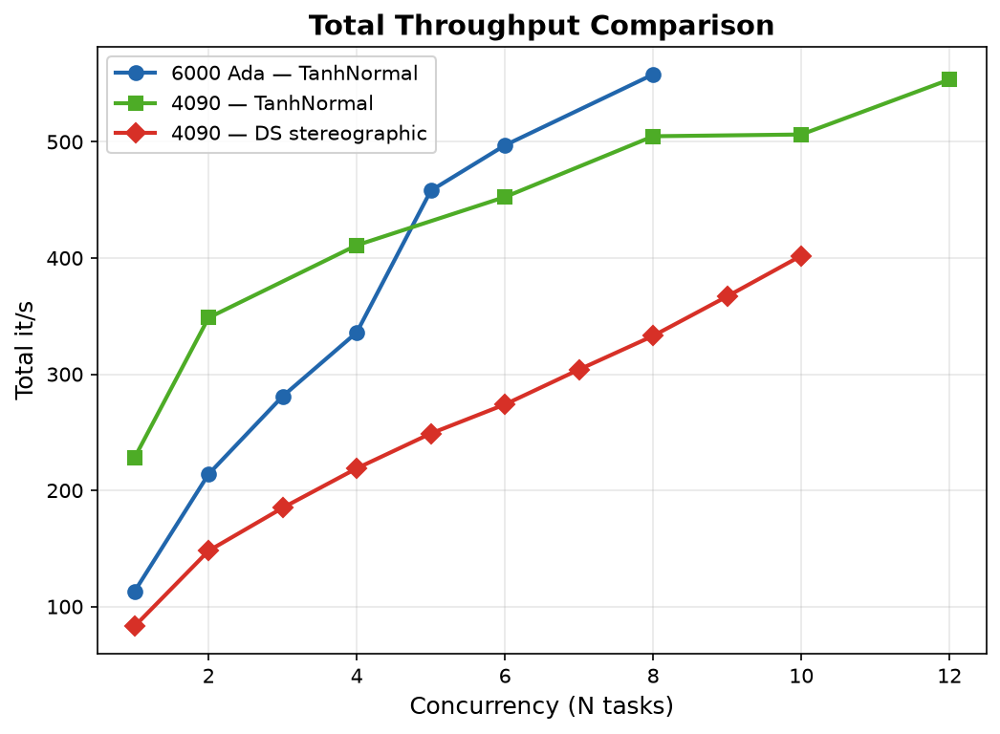
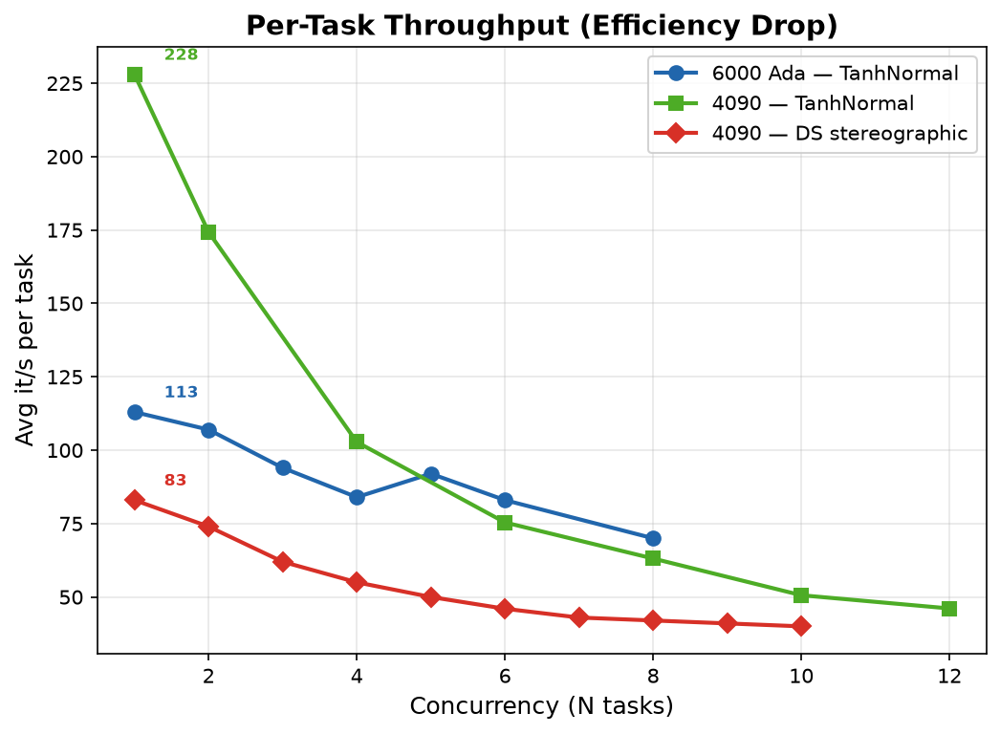
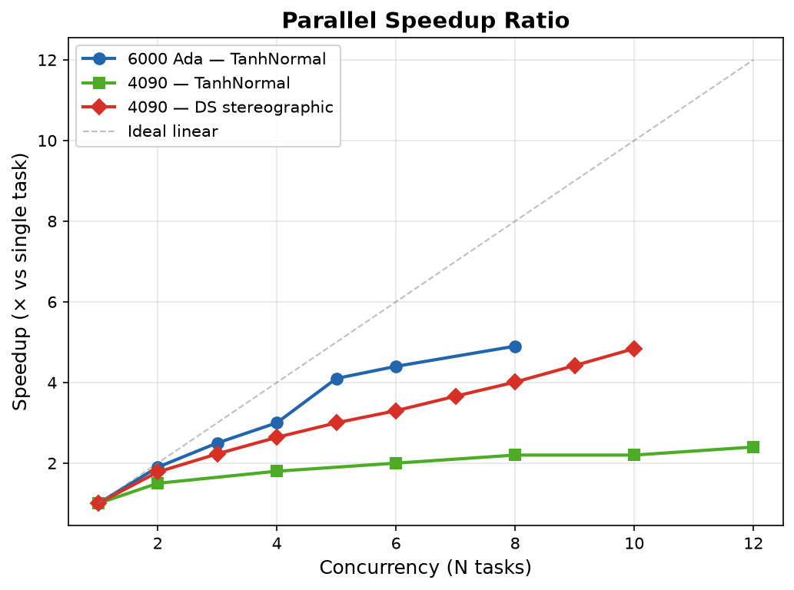

# 并行训练压力测试

## 硬件环境

| 项目 | 规格 |
|------|------|
| GPU | 1× NVIDIA RTX 6000 Ada Generation (48GB)，单卡测试 |
| CPU | 32 逻辑核，单 NUMA 节点 |
| OS | Linux (X11) |
| CUDA | 12.9 |
| Driver | 575.57.08 |

> 注意：实验室有两张 RTX 6000 Ada，但压力测试仅使用单卡（`CUDA_VISIBLE_DEVICES=0`），另一张卡被 RoboTwin 占用。

## 方法

每个实验跑 20,000 步，`start_training=5000`（默认，前 5000 步为 warmup 无训练更新），取 JAX 编译后的稳定速度。通过 `taskset` 绑定不同 CPU 核，`XLA_PYTHON_CLIENT_MEM_FRACTION=0.10` 限制显存预分配。命令：

```bash
taskset -c <start>-<end> env CUDA_VISIBLE_DEVICES=0 \
    XLA_PYTHON_CLIENT_MEM_FRACTION=0.10 \
    python main_online.py --env_name=cube-triple-play-singletask-task2-v0 \
    --sparse=False --horizon_length=1 \
    --online_steps=20000 --start_training=5000 --eval_episodes=2 &
```

## 结果

### RLPD (TanhNormal)

| 并发数 | 核/进程 | 总核数 | 总 it/s | 倍率 | 每进程 it/s | GPU 利用率 |
|:---:|:---:|:---:|:------:|:---:|:---:|:---:|
| 1 | 8 | 8 | 113 | 1.0× | 113 | ~33% |
| 2 | 8 | 16 | 214 | 1.9× | 107 | ~45% |
| 3 | 8 | 24 | 281 | 2.5× | 94 | ~55% |
| 4 | 4 | 16 | 336 | 3.0× | 84 | ~65% |
| 5 | 6 | 30 | 458 | 4.1× | 92 | ~75% |
| 6 | 5 | 30 | 497 | 4.4× | 83 | ~80% |
| **8** | **4** | **32** | **558** | **4.9×** | 70 | ~90% |
| 10 | 2 | 20 | ❌ | — | — | — |

## 结论

- **最佳配置：8 并发 × 4 核，单卡总吞吐 558 it/s，是单进程的 4.9 倍**
- 10 并发崩溃，6/10 静默失败，推测 CUDA context 或 JAX 编译并发冲突
- 每实验实际显存 ~1.5GB，预分配 5–10% 足够，48GB 单卡显存非瓶颈
- 单进程 GPU 利用率仅 33%，CPU 数据管线是唯一瓶颈；并行化通过 GPU 分时复用解决，8 并发 GPU 利用率 ~90%

---

## RTX 4090 压力测试

### 硬件环境

| 项目 | 规格 |
|------|------|
| GPU | 1× NVIDIA GeForce RTX 4090 (24GB) |
| CPU | 32 逻辑核，单 NUMA 节点 |
| CUDA | 12.8 |
| Driver | 570.181 |

### 方法

每个实验跑 5,000 步，`start_training=1000`（前 1000 步为 warmup 无训练更新），取 JIT 编译后的稳定速度。通过 `taskset` 绑定 CPU 核，`XLA_PYTHON_CLIENT_MEM_FRACTION=0.05` 限制显存，`XLA_PYTHON_CLIENT_PREALLOCATE=false` 动态分配：

```bash
taskset -c <start>-<end> env CUDA_VISIBLE_DEVICES=0 \
    XLA_PYTHON_CLIENT_MEM_FRACTION=0.05 XLA_PYTHON_CLIENT_PREALLOCATE=false \
    .venv/bin/python main_online.py --env_name=cube-triple-play-singletask-task2-v0 \
    --online_steps=5000 --eval_episodes=2 --eval_interval=0 --horizon_length=1 \
    --start_training=1000 --action_decompose=False &
```

> 与 6000 Ada 测试差异：`main.py` 路径为 `.venv/bin/python`（不用 `uv run`），`MEM_FRACTION=0.05` 而非 `0.10`，步数 5K 而非 20K，核数固定每进程 32/N。

### 结果

| 并发数 | 核/进程 | 总 it/s | 倍率 | 每进程 | GPU util | 显存 | 状态 |
|:--:|:--:|------|:--:|:--:|:--:|:--:|:--:|
| 1 | 32 | 228 | 1.0× | 228 | 33% | 2GB | ✅ |
| 2 | 16 | 349 | 1.5× | 175 | 68% | 2GB | ✅ |
| 4 | 8 | 411 | 1.8× | 103 | 96% | 4GB | ✅ |
| 6 | 5 | 453 | 2.0× | 75 | 100% | 6GB | ✅ |
| 8 | 4 | 505 | 2.2× | 63 | 100% | 8GB | ✅ |
| 10 | 3 | 506 | 2.2× | 51 | 100% | 10GB | ✅ |
| **12** | **2** | **554** | **2.4×** | 46 | 100% | 12GB | ✅ |

> N=12 全部存活，总吞吐 554 it/s。N=8 时 GPU 已达 100% 利用率，继续增加并发通过更细粒度的 GPU 分时复用仍可小幅提升吞吐。12 并发每进程仅 2 核，CPU 严重受限但 GPU 端仍有重叠空间。

### 测试参数对比

| | RTX 4090 | RTX 6000 Ada |
|--|:--:|:--:|
| online_steps | 5,000 | 20,000 |
| start_training (warmup) | 1,000 | 5,000 |
| 有效训练步数 | 4,000 | 15,000 |
| eval_interval | 0 | 0 |
| horizon_length | 1 | 1 |

> `start_training` 期间无训练更新（纯 env 交互），测得的 it/s 偏高。理想设置应为 `start_training=0`，留待后续修正。

### 双卡对比

| | RTX 4090 (24GB) | RTX 6000 Ada (48GB) |
|--|:--:|:--:|
| 单进程基线 | **228 it/s** | 113 it/s |
| 最佳并发 | **12** (全存活) | 8 (N=10 崩溃) |
| 最佳吞吐 | 554 it/s | **558 it/s** |
| 倍率 | 2.4× | **4.9×** |
| 瓶颈 | GPU 100% + CPU | CPU 数据管线 |
| 最大显存 | 12GB / 24GB | 12GB / 48GB |

### 汇总对比图







### 结论

- **RTX 4090 最佳配置：8–12 并发，总吞吐 505–554 it/s**
- 4090 单进程 228 it/s 是 6000 Ada 113 it/s 的 **2×**，但并行倍率低（2.4× vs 4.9×）——因为 4090 GPU 更快，单进程已用 33% GPU，并行提升空间更小
- 12 并发全部存活（6000 Ada 在 N=10 已崩溃），显存仅用 12GB/24GB——24GB 显存非瓶颈
- 核数分配：`32/N` 自动均分，N=12 时每进程仅 2.7 核，CPU 严重受限但 JAX 编译 + MuJoCo 仿真仍可运行
- 与 6000 Ada 一致：每实验实际显存 ~1.5GB，`MEM_FRACTION=0.05` 足够

---

## RTX 4090 — DS-RLPD 压力测试（stereographic, 无 warmup）

### 动机

前述测试均使用 TanhNormal（无 DS），且包含 warmup（`start_training=1000/5000`）。本次测试使用**最重的 DS 实现**（stereographic Jacobian bijector），**无 warmup**（JIT 编译计入测量），并改用 `schedule.py` 统一调度，贴近生产环境。

### 方法

- **入口**: `main_online.py`
- **环境**: `cube-triple-play-singletask-task2-v0`
- **DS 模式**: `stereographic`（包含 Jacobian bijector 计算，显存和计算压力最大）
- **步数**: 10,000（前 5,000 步 `start_training` warmup 无训练更新，后 5,000 步有效训练）
- **H=1**（无 action chunking 开销）
- **无 eval**（`eval_interval=0`, `eval_episodes=0`）
- **无 checkpoint**（`save_interval=-1`）
- **WANDB_MODE=disabled**
- **CPU**: 未手动绑核（由 OS 调度）
- **显存**: `XLA_PYTHON_CLIENT_PREALLOCATE=false`, `MEM_FRACTION=0.05`
- **调度**: `schedule.py --gpu_tasks=N --stagger=0`，每并发级独立编译执行
- **测量**: 解析 schedule.py 日志，从首个启动到末个完成的时间差计算墙钟

```bash
# 等效命令（schedule.py 封装）
CUDA_VISIBLE_DEVICES=0 MUJOCO_GL=egl \
  XLA_PYTHON_CLIENT_PREALLOCATE=false XLA_PYTHON_CLIENT_MEM_FRACTION=0.05 \
  WANDB_MODE=disabled \
  python -u schedule.py --run=tasks.compiled.json --gpus=0 --gpu_tasks=N --stagger=0
```

### 结果

| 并发 N | 墙钟 (s) | 总算力 (it/s) | 单任务 (it/s) | 效率 | vs N=1 |
|:---:|:---:|:---:|:---:|:---:|:---:|
| 1 | 121 | 83 | 83 | 100% | 1.00× |
| 2 | 135 | 148 | 74 | 89% | 1.78× |
| 3 | 162 | 185 | 62 | 75% | 2.23× |
| **4** | **183** | **219** | **55** | **66%** | **2.64×** |
| 5 | 201 | 249 | 50 | 60% | 3.00× |
| 6 | 219 | 274 | 46 | 55% | 3.30× |
| 7 | 230 | 304 | 43 | 52% | 3.66× |
| 8 | 240 | 333 | 42 | 51% | 4.01× |
| 9 | 245 | 367 | 41 | 49% | 4.42× |
| 10 | 249 | 402 | 40 | 48% | 4.84× |

> 详细曲线见上方汇总对比图。

> 数据：[`RTX4090_24GB/results_ds_stereographic.json`](data/parallel_benchmark/RTX4090_24GB/results_ds_stereographic.json)

### 与 TanhNormal 测试对比

| | DS stereographic | TanhNormal (旧) |
|--|:--:|:--:|
| 单进程基线 | 83 it/s | 228 it/s |
| 最大并发 | 10 (全存活) | 12 (全存活) |
| 最大总算力 | 402 it/s | 554 it/s |
| 倍率 | 4.84× | 2.4× |
| 瓶颈 | GPU + JIT | GPU 100% + CPU |
| warmup | 5,000 步 | 1,000 步 |
| 调度 | schedule.py | taskset + 子进程 |

### 结论

- **DS stereographic 单进程比 TanhNormal 慢 2.7×**（83 vs 228 it/s），Jacobian bijector 计算开销显著
- 虽然单进程更慢，**并行倍率更高**（4.84× vs 2.4×）——慢任务 GPU 利用率更低，并行提升空间更大
- **截至 N=10 无 OOM**，显存非瓶颈，总算力未饱和（仍在增长）
- **推荐生产 --gpu_tasks=4**：均衡点，单任务 55 it/s 保持 66% 效率，总算力 2.64×
- 追求总算力可开到 10+，但单任务效率降至 ~48%
- `schedule.py` 调度与手动 `taskset` 在吞吐上表现一致，无额外开销
